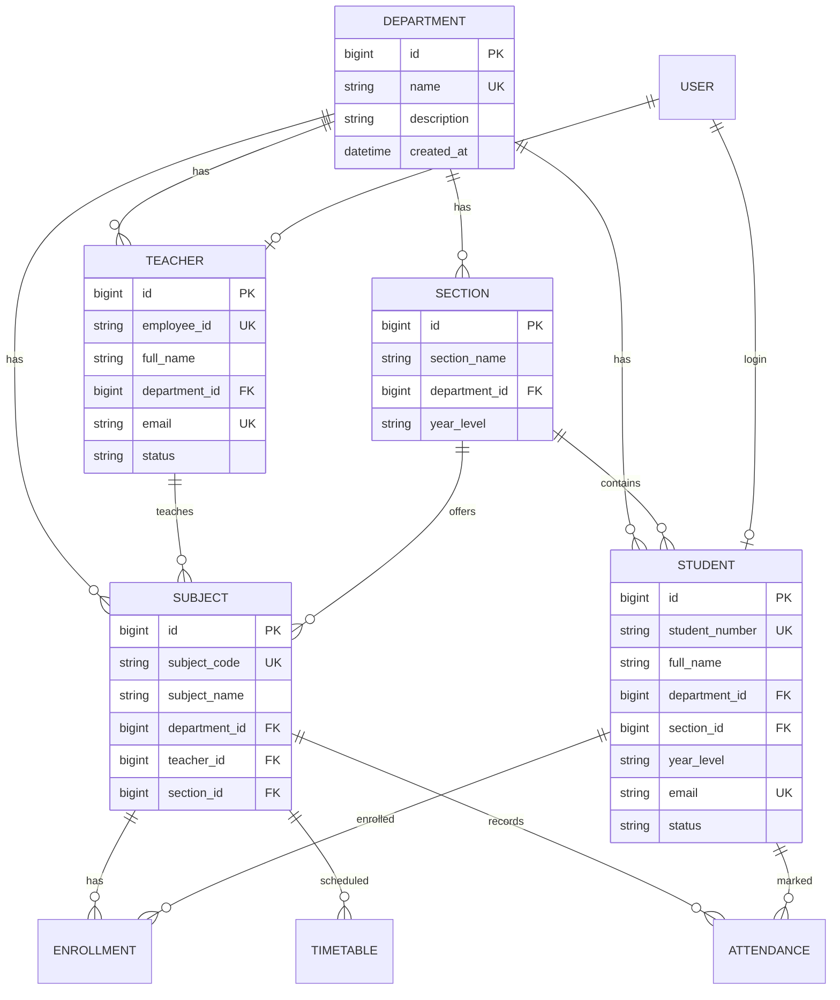

# School Attendance Management System — Architecture (V2)

## Entity Relationship Diagram



## Suggested Folder Structure

```
src/main/java/com/attendance/
├── config/          # Security, migrations, data seeding
├── controller/      # MVC controllers (Thymeleaf)
│   └── api/         # REST APIs (/api/v1)
├── dto/             # API & view DTOs
├── exception/       # BusinessException, handlers
├── model/           # JPA entities & enums
├── repository/      # Spring Data JPA
├── service/         # Business logic & validation
└── util/            # Helpers (ValidationHelper)

src/main/resources/
├── static/css|js/   # Theme, forms, lookup-filter.js
├── templates/
│   ├── admin/       # Admin dashboards & CRUD pages
│   ├── teacher/
│   └── student/
└── application.properties

database/
└── schema_v2.sql    # Canonical PostgreSQL schema
```

## Dashboard Sidebar (Admin)

| Link | Purpose |
|------|---------|
| Dashboard | Overview stats & charts |
| **Departments** | CRUD + entity counts |
| Create / Add | Unified create forms |
| Students | Filter: department → year → section |
| Teachers | Filter by department |
| Subjects | Filter by department |
| Sections | Filter: department → year level |
| Reports | PDF exports |
| Trends | Weekly/monthly analytics |

## REST APIs

| Method | Endpoint | Description |
|--------|----------|-------------|
| GET | `/api/v1/departments` | Paginated department list with counts |
| GET | `/api/v1/departments/{id}` | Department detail |
| POST | `/api/v1/departments` | Create department |
| PUT | `/api/v1/departments/{id}` | Update department |
| DELETE | `/api/v1/departments/{id}` | Delete (if no links) |
| GET | `/api/v1/admin/lookups/teachers?departmentId=` | Teachers for dropdown |
| GET | `/api/v1/admin/lookups/sections?departmentId=&yearLevel=` | Sections for dropdown |

## Role-Based Access

| Role | Access |
|------|--------|
| **ADMIN** | Full `/admin/**` + `/api/v1/**` |
| **TEACHER** | `/teacher/**` — own subjects, attendance, trends |
| **STUDENT** | `/student/**` — own attendance, timetable, trends |

## Dynamic Filtering

- **Students / Sections**: Department → Year Level → Section drill-down
- **Teachers / Subjects**: Department filter
- **Create forms**: `lookup-filter.js` loads teachers/sections via REST when department (and year) changes

## Validation Rules (enforced in services)

- Department must exist before linking entities
- Teacher, student, section, subject require `department_id`
- Student requires `section_id` matching department + year level
- Subject teacher and section must belong to subject's department
- Unique: `employee_id`, `student_number`, `email`, `subject_code`
- Default usernames: employee ID (teacher), student number (student)

## Previous Design Flaws & Improvements

| Flaw | Improvement |
|------|-------------|
| `course` / `department` as free-text strings | Normalized `Department` entity with FK relationships |
| No referential integrity | JPA `@ManyToOne` + DB foreign keys |
| Duplicate emails/IDs possible | Unique constraints + service validation |
| Teacher/section dropdowns showed all records | REST lookup APIs filtered by department |
| Mixed create forms on list pages | Dedicated Create / Add + Department management page |
| No department delete guard | Block delete when linked records exist |
| Plain `window.confirm` | Custom themed confirmation modal |
| Trends cluttering main dashboard | Dedicated Trends pages per role |

## Remaining Enhancements (optional)

- Server-side pagination on all list pages (repositories support `Pageable`)
- BCrypt password encoding (currently NoOp for dev)
- Separate TeacherDTO/StudentDTO for API responses
- Soft-delete for students/teachers instead of hard delete
