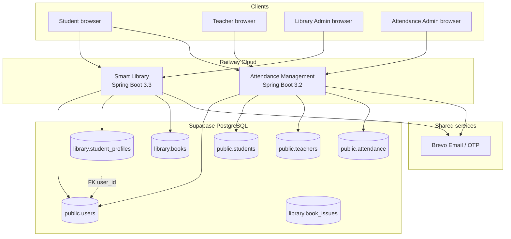
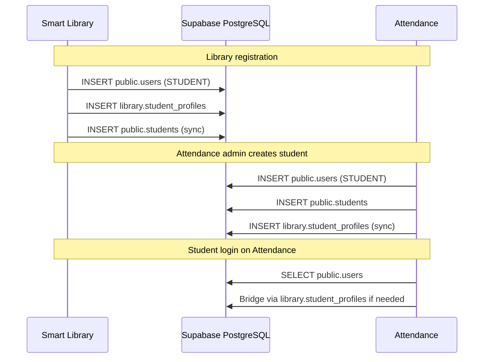
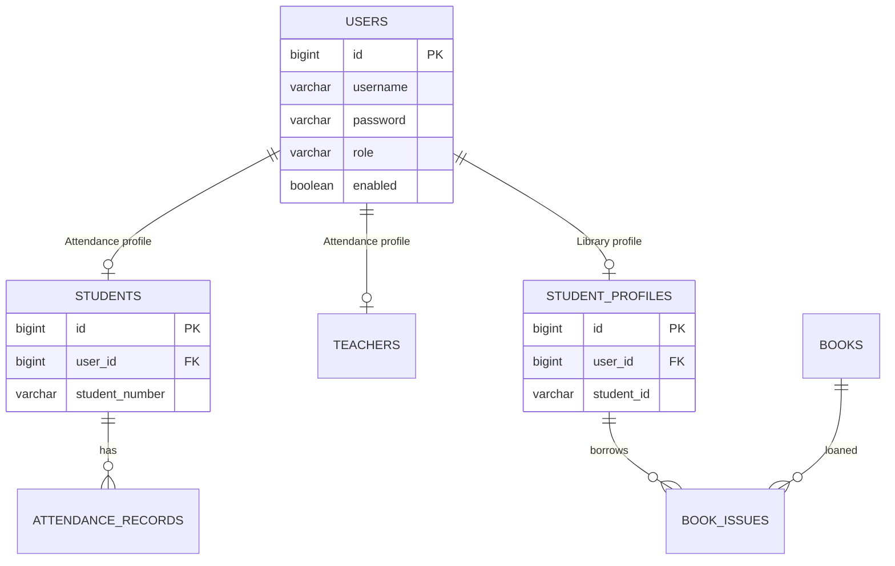

# LU Centralized System — Integration Architecture

This document describes how **Smart Library** (EduLibrary) and **Attendance Management** (EduPresence) integrate as one platform.

| Application | Port (local) | Admin portal | Schema |
|-------------|--------------|--------------|--------|
| Smart Library | 8080 | `/admin` | `library` |
| Attendance Management | 8081 | `/admin/dashboard` | `public` |

Both applications deploy to **Railway** and connect to the **same Supabase PostgreSQL** database.

---

## High-level architecture

---

## Integration mechanisms

### 1. Shared authentication (`public.users`)

Phase 3 shared auth stores **all login accounts** in `public.users`. Both apps authenticate against the same table with BCrypt-hashed passwords.

- Library `User` entity → `public.users`
- Attendance `User` entity → `public.users`
- Roles: `ADMIN`, `TEACHER`, `STUDENT` (per app context)

**Result:** A student who registers in Library can log in to Attendance with the same credentials (and vice versa when profiles are synced).

### 2. Schema separation

| Schema | Owner app | Examples |
|--------|-----------|----------|
| `public` | Attendance | `users`, `students`, `teachers`, `subjects`, `attendance_records`, `audit_logs` |
| `library` | Library | `books`, `categories`, `authors`, `book_issues`, `student_profiles`, `otp_codes` |

Hibernate default schema:
- Library → `library` (with explicit `public.users` mapping on User entity)
- Attendance → `public`

### 3. Bidirectional student profile sync

Student identity is linked across schemas through JDBC sync services (not HTTP APIs):

| Direction | Service class | Purpose |
|-----------|---------------|---------|
| Library → Attendance | `SharedAttendanceStudentProfileSyncService` | Creates/updates `public.students` when Library registers a student |
| Attendance → Library | `SharedLibraryStudentProfileSyncService` | Creates/updates `library.student_profiles` when Attendance creates a student |
| Attendance login bridge | `SharedAttendanceStudentProfileBridgeService` | Ensures Attendance student row exists from shared user |
| Library login bridge | `SharedLibraryStudentProfileBridgeService` | Ensures Library profile exists for shared student |

### 4. Shared security features

Both apps apply migrations from `db/security_features.sql` on startup via `SharedAuthDataSourceMigrationProcessor`:

- Account lockout columns on `public.users`
- `public.audit_logs` for login and admin actions
- Consistent session timeout (20 minutes)

### 5. Shared email (Brevo)

Both apps use the same Brevo SMTP/API configuration (`LU Centralized System` sender) for:

- Registration OTP (Library)
- Forgot password OTP (both apps)
- Password change OTP (Library admin)
- Book due reminders (Library)

### 6. Role-based login routing

| Role | Library login | Attendance login |
|------|---------------|------------------|
| STUDENT | `/login` → student portal | `/login` → student dashboard |
| ADMIN | `/admin/login` → library admin | `/login` → admin dashboard |
| TEACHER | Blocked — redirected to Attendance URL | `/login` → teacher dashboard |

Configuration: Library `library.attendance-app-url` / env `ATTENDANCE_APP_URL`.

---

## Database relationships (ERD excerpt)

Foreign key: `library.student_profiles.user_id` → `public.users.id`

---

## Deployment integration

| Item | Library | Attendance |
|------|---------|------------|
| Platform | Railway | Railway |
| Container | Nixpacks / JAR | Dockerfile |
| Port | `PORT` (default 8080) | `PORT` (default 8081) |
| Database | `SUPABASE_DB_*` | `SUPABASE_DB_*` (same values) |
| Email | `BREVO_*`, `MAIL_*` | `BREVO_*`, `MAIL_*` |

Both services must point to the **same Supabase project** for integration to work.

---

## Demonstration flow (defense)

1. **Shared student login** — Log in as `student1` on Library (`/login`), then on Attendance (`/login`) with the same credentials.
2. **Library Admin** — Log in at `/admin/login`, manage books, issue/return, analytics.
3. **Attendance Admin** — Log in at `/login`, manage departments, students, teachers, reports.
4. **Security** — Show OTP forgot-password flow, account lockout after failed attempts, audit logs.
5. **Data consistency** — Register a new student in Library; verify profile appears in Attendance admin student list (after sync).

---

## Technology stack (middleware)

| Layer | Implementation |
|-------|----------------|
| Framework | Spring Boot 3.x, Spring MVC |
| Security | Spring Security, BCrypt, role-based access |
| Persistence | Spring Data JPA, Hibernate, HikariCP |
| View | Thymeleaf + Spring Security extras |
| Database | PostgreSQL (Supabase Session Pooler) |
| Email | Brevo SMTP / HTTPS API |
| QR / reports | ZXing, Apache POI, iText (Attendance) |

---

## Related documentation

- [Attendance README](../README.md)
- [Library README](../../LIBRARY MANAGEMENT/README.md)
- [Library database migrations](../../LIBRARY MANAGEMENT/smart-library/database/README.md)
- [Attendance schema](../database/schema_postgres.sql)
